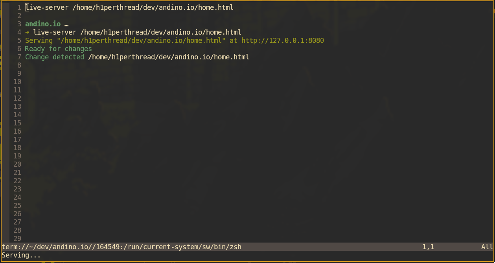

# nvim-liveserver
A simple Lua 'live-server' plugin for Neovim for ease of development.

# Install Using Packer
1. In your `packer.lua` add `diegoandino/nvim-liveserver`
2. Run `:PackerSync`
3. In your `init.lua` add `require"nvim-liveserver"`
4. To test, run: `:LiveServer` and it should start serving the current file or directory open

# Install Using Plug (e.g., vim-plug)
1. Add `Plug 'diegoandino/nvim-liveserver'`
2. Run `:PlugInstall`
3. Add `lua require"nvim-liveserver"` to init.vim (or to where you have it setup at)
